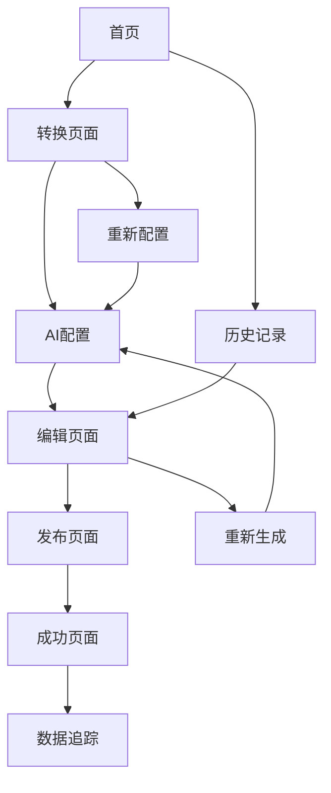

## 1. 产品概述

小程序转公众号AI生成工具，帮助用户将小程序内容智能转换为公众号文章格式。解决小程序运营者需要同步内容到公众号的痛点，提升内容复用效率。

面向小程序开发者和运营人员，通过AI技术实现一键转换，节省人工编辑时间，扩大内容传播渠道。

## 2. 核心功能

### 2.1 用户角色

| 角色    | 注册方式      | 核心权限            |
| ----- | --------- | --------------- |
| 普通用户  | 微信小程序授权登录 | 基础转换功能，每日3次免费额度 |
| VIP用户 | 微信支付升级    | 无限制转换，高级模板，优先客服 |

### 2.2 功能模块

核心页面包括：

1. **首页**：功能介绍、快速转换入口、历史记录
2. **转换页面**：小程序内容输入、AI生成配置、实时预览
3. **编辑页面**：内容调整、格式优化、图片处理
4. **发布页面**：公众号对接、文章发布、数据追踪

### 2.3 页面详情

| 页面名称 | 模块名称   | 功能描述                   |
| ---- | ------ | ---------------------- |
| 首页   | 功能介绍区  | 展示产品核心优势，轮播图介绍使用场景     |
| 首页   | 快速转换入口 | 上传小程序码或输入小程序AppID开始转换  |
| 首页   | 历史记录   | 显示最近10次转换记录，支持重新编辑     |
| 转换页面 | 内容输入   | 支持小程序码扫描、AppID输入、URL导入 |
| 转换页面 | AI配置面板 | 选择文章风格、字数要求、重点突出设置     |
| 转换页面 | 实时预览   | 左侧显示原始内容，右侧显示AI生成效果    |
| 编辑页面 | 内容编辑器  | 富文本编辑，支持标题、段落、图片调整     |
| 编辑页面 | 图片优化   | AI图片重绘、尺寸调整、水印添加       |
| 编辑页面 | 格式模板   | 提供10种公众号排版模板一键应用       |
| 发布页面 | 公众号绑定  | 微信扫码授权绑定公众号账号          |
| 发布页面 | 发布设置   | 设置定时发布、原创声明、留言功能       |
| 发布页面 | 数据追踪   | 实时显示阅读量、点赞数、转化率数据      |

## 3. 核心流程

### 3.1 完整用户操作流程

1. **进入小程序**：用户微信搜索或扫码进入小程序
2. **授权登录**：点击"立即使用"，完成微信授权登录
3. **选择输入方式**：

   * 扫描小程序码自动识别

   * 手动输入小程序AppID

   * 粘贴小程序页面URL
4. **AI智能分析**：

   * 系统爬取小程序页面内容

   * AI提取核心功能点和特色

   * 分析目标用户群体和使用场景
5. **配置生成参数**：

   * 选择文章风格（科技/生活/商业等）

   * 设置文章字数（500-3000字）

   * 指定重点突出内容
6. **AI内容生成**：

   * 生成文章标题（提供3个选项）

   * 撰写引人入胜的开头和结尾

   * 将功能介绍转化为用户价值描述

   * 添加相关案例和使用场景
7. **内容预览与编辑**：

   * 查看AI生成的完整文章

   * 不满意可重新生成或手动调整

   * 优化段落结构和语言表达
8. **图片处理优化**：

   * AI识别原小程序截图

   * 重新设计适合公众号的配图

   * 调整尺寸为900x500像素

   * 添加品牌水印和二维码
9. **公众号绑定**：

   * 首次使用需授权绑定公众号

   * 支持绑定多个公众号账号

   * 验证管理员身份和权限
10. **发布设置**：

    * 选择目标公众号

    * 设置定时发布时间

    * 配置原创声明和留言功能
11. **一键发布**：

    * 内容同步到公众号草稿箱

    * 可选择立即发布或定时发布

    * 自动生成封面图和摘要
12. **效果追踪**：

    * 实时监控文章阅读数据

    * 统计用户转化行为

    * 生成数据报告供优化参考

### 3.2 页面导航流程图

## 4. 用户界面设计

### 4.1 设计风格

* **主色调**：科技蓝 (#1890FF) + 纯净白 (#FFFFFF)

* **辅助色**：成功绿 (#52C41A)、警告橙 (#FAAD14)

* **按钮样式**：圆角矩形，悬浮有阴影效果

* **字体**：主标题24px，正文16px，辅助文字14px

* **布局风格**：卡片式布局，留白充足，层次分明

* **图标风格**：线性图标，简洁现代，统一2px线宽

### 4.2 页面设计概述

| 页面名称 | 模块名称   | UI元素                 |
| ---- | ------ | -------------------- |
| 首页   | 顶部导航   | 左侧Logo，右侧用户头像，简洁白色背景 |
| 首页   | Hero区域 | 渐变蓝色背景，动态AI图标，突出转换效率 |
| 转换页面 | 输入区域   | 拖拽上传区域，支持多种输入方式切换    |
| 转换页面 | 配置面板   | 折叠式菜单，滑块选择器，实时预览窗口   |
| 编辑页面 | 编辑器    | 左侧大纲，中间编辑区，右侧工具栏     |
| 发布页面 | 账号选择   | 公众号头像列表，单选框选择，权限提示   |

### 4.3 响应式设计

* 采用桌面端优先设计策略

* 移动端自适应布局，最大宽度750px

* 触摸优化：按钮最小44px，增加触摸反馈

* 图片懒加载，减少移动端流量消耗

### 4.4 交互细节

* 加载动画：AI生成时显示智能思考动画

* 进度提示：多步骤流程显示进度条

* 操作反馈：成功/失败都有明确的toast提示

* 手势支持：左

