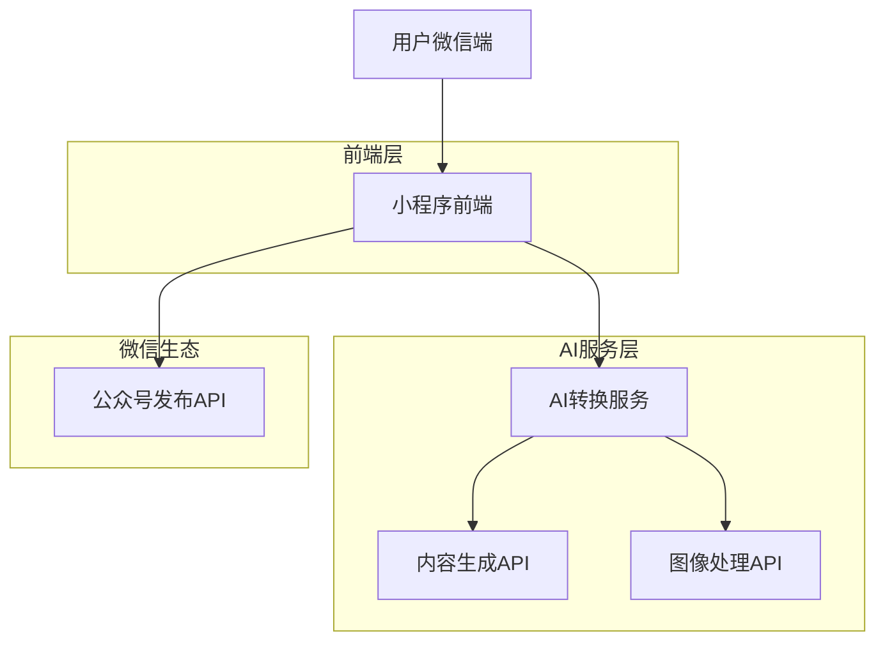
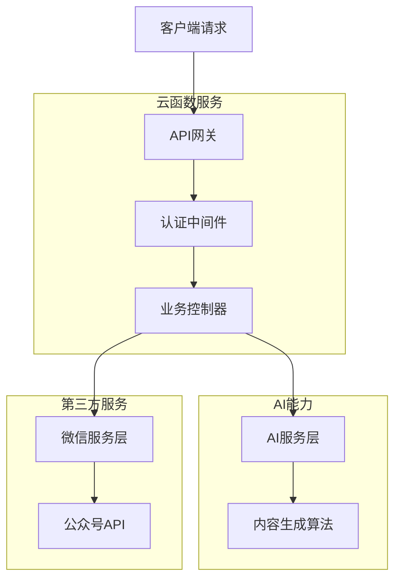
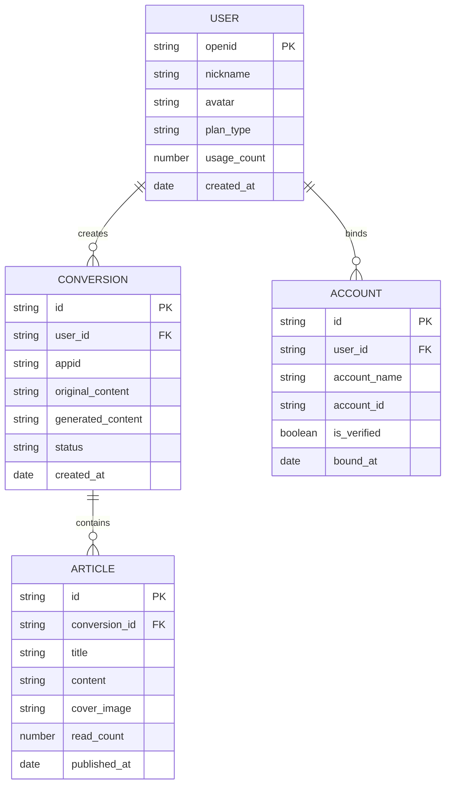

## 1. 架构设计



## 2. 技术栈描述

- **前端**: 微信小程序原生框架 + WeUI组件库
- **初始化工具**: 微信开发者工具
- **后端**: 云开发(CloudBase) + Node.js
- **AI服务**: 腾讯云AI接口 + 自研内容生成算法
- **数据库**: 云开发数据库(文档型)

## 3. 路由定义

| 路由 | 用途 |
|-------|---------|
| /pages/index/index | 首页，功能介绍和快速入口 |
| /pages/convert/convert | 转换页面，内容输入和AI配置 |
| /pages/edit/edit | 编辑页面，内容优化和格式调整 |
| /pages/publish/publish | 发布页面，公众号对接和发布设置 |
| /pages/history/history | 历史记录，查看过往转换记录 |
| /pages/result/result | 结果页面，发布成功和数据展示 |

## 4. API定义

### 4.1 核心API

**小程序内容提取**
```
POST /api/extract-miniprogram
```

请求参数:
| 参数名 | 参数类型 | 必填 | 描述 |
|-----------|-------------|-------------|-------------|
| appid | string | true | 小程序AppID |
| path | string | false | 小程序页面路径 |
| type | string | true | 提取类型：basic/detail |

响应:
| 参数名 | 参数类型 | 描述 |
|-----------|-------------|-------------|
| title | string | 小程序标题 |
| description | string | 功能描述 |
| screenshots | array | 页面截图URL列表 |
| features | array | 功能特性列表 |

**AI内容生成**
```
POST /api/generate-content
```

请求参数:
| 参数名 | 参数类型 | 必填 | 描述 |
|-----------|-------------|-------------|-------------|
| content | object | true | 原始内容数据 |
| style | string | true | 文章风格：tech/life/business |
| word_count | number | true | 目标字数：500-3000 |
| emphasis | array | false | 重点突出内容 |

响应:
| 参数名 | 参数类型 | 描述 |
|-----------|-------------|-------------|
| title | string | 生成的主标题 |
| titles | array | 3个标题选项 |
| content | string | 完整的文章内容 |
| summary | string | 文章摘要 |

**公众号发布**
```
POST /api/publish-official
```

请求参数:
| 参数名 | 参数类型 | 必填 | 描述 |
|-----------|-------------|-------------|-------------|
| title | string | true | 文章标题 |
| content | string | true | HTML格式的内容 |
| cover_img | string | true | 封面图片URL |
| account_id | string | true | 目标公众号ID |
| publish_time | string | false | 定时发布时间 |

响应:
| 参数名 | 参数类型 | 描述 |
|-----------|-------------|-------------|
| article_id | string | 公众号文章ID |
| status | string | 发布状态 |
| draft_url | string | 草稿箱链接 |

## 5. 服务器架构图



## 6. 数据模型

### 6.1 数据模型定义



### 6.2 数据定义语言

**用户表 (users)**
```javascript
{
  "openid": "string",
  "nickname": "string",
  "avatar": "string",
  "plan_type": "string", // free, premium
  "usage_count": "number",
  "created_at": "timestamp",
  "updated_at": "timestamp"
}
```

**转换记录表 (conversions)**
```javascript
{
  "id": "string",
  "user_id": "string",
  "appid": "string",
  "original_content": {
    "title": "string",
    "description": "string",
    "screenshots": ["string"],
    "features": ["string"]
  },
  "generated_content": {
    "title": "string",
    "content": "string",
    "style": "string"
  },
  "status": "string", // pending, processing, completed, failed
  "created_at": "timestamp",
  "completed_at": "timestamp"
}
```

**文章发布表 (articles)**
```javascript
{
  "id": "string",
  "conversion_id": "string",
  "title": "string",
  "content": "string",
  "cover_image": "string",
  "account_id": "string",
  "official_article_id": "string",
  "read_count": "number",
  "like_count": "number",
  "status": "string", // draft, published, scheduled
  "published_at": "timestamp",
  "created_at": "timestamp"
}
```

**公众号账号表 (accounts)**
```javascript
{
  "id": "string",
  "user_id": "string",
  "account_name": "string",
  "account_id": "string",
  "access_token": "string",
  "refresh_token": "string",
  "expires_at": "timestamp",
  "is_verified": "boolean",
  "bound_at": "timestamp"
}
```