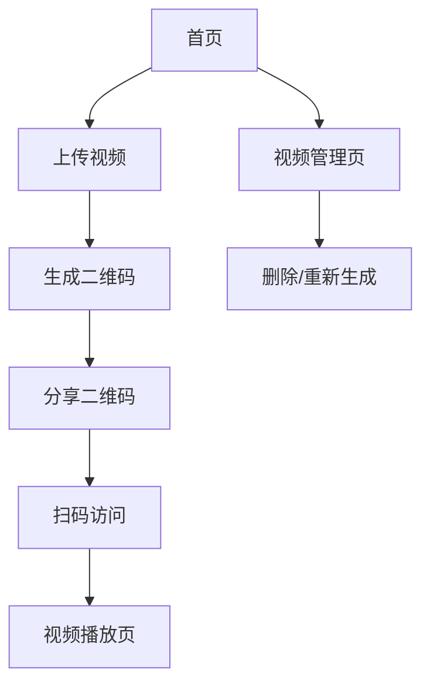

## 1. 产品概述
一个简洁高效的视频上传和二维码分享平台，用户可以轻松上传视频到云端，自动生成二维码，他人扫码即可观看视频。

解决传统视频分享方式繁琐的问题，为个人和小团队提供便捷的视频传播工具。

## 2. 核心功能

### 2.1 用户角色
| 角色 | 注册方式 | 核心权限 |
|------|----------|----------|
| 访客用户 | 无需注册 | 扫码观看视频 |
| 注册用户 | 邮箱注册 | 上传视频、管理个人视频库、生成二维码 |

### 2.2 功能模块
系统包含以下核心页面：
1. **首页**: 上传区域、视频预览、二维码生成
2. **视频管理页**: 个人视频列表、删除功能、重新生成二维码
3. **视频播放页**: 视频播放、全屏、分享功能

### 2.3 页面详情
| 页面名称 | 模块名称 | 功能描述 |
|----------|----------|----------|
| 首页 | 上传区域 | 拖拽或点击上传视频文件，支持MP4/MOV格式，最大500MB |
| 首页 | 视频预览 | 上传后立即显示视频缩略图和基本信息 |
| 首页 | 二维码生成 | 自动生成二维码，支持下载和复制链接 |
| 视频管理页 | 视频列表 | 显示所有已上传视频的缩略图、标题、上传时间 |
| 视频管理页 | 操作功能 | 删除视频、重新生成二维码、复制分享链接 |
| 视频播放页 | 视频播放器 | 支持播放/暂停、进度条、音量控制、全屏播放 |
| 视频播放页 | 分享功能 | 显示二维码、提供复制链接按钮 |

## 3. 核心流程
用户操作流程：
1. 注册用户登录系统
2. 在首页上传视频文件
3. 系统自动处理视频并生成二维码
4. 用户下载二维码或直接分享链接
5. 访客扫描二维码访问视频播放页观看内容

## 4. 用户界面设计

### 4.1 设计风格
- **主色调**: 纯白色(#FFFFFF)背景，天蓝色(#007AFF)作为主色
- **按钮样式**: 圆角矩形设计，扁平化风格，悬停有轻微阴影效果
- **字体**: 系统默认字体，标题18-24px，正文14-16px
- **布局风格**: 卡片式布局，大留白，居中对称设计
- **图标风格**: 使用简洁的线性图标，统一线条粗细

### 4.2 页面设计概述
| 页面名称 | 模块名称 | UI元素 |
|----------|----------|--------|
| 首页 | 上传区域 | 大卡片设计，中央上传按钮，拖拽区域有明显边框，上传进度条显示 |
| 首页 | 视频预览 | 16:9视频缩略图，下方显示视频标题和时长，信息排版简洁 |
| 首页 | 二维码生成 | 二维码居中显示，下方提供下载和复制按钮，按钮采用圆角设计 |
| 视频管理页 | 视频列表 | 网格布局展示视频卡片，每张卡片包含缩略图、标题、操作按钮 |
| 视频播放页 | 播放器 | 全宽视频播放器，控制栏简洁，支持全屏和分享功能 |

### 4.3 响应式设计
- 桌面优先设计，支持1920x1080标准分辨率
- 平板适配：768px以上保持完整功能
- 手机适配：375px以上，采用单列布局
- 触摸优化：按钮最小44px触摸区域

### 4.4 浅色模式强制
系统强制使用浅色模式，禁用深色模式切换功能，确保所有用户界面保持一致性。