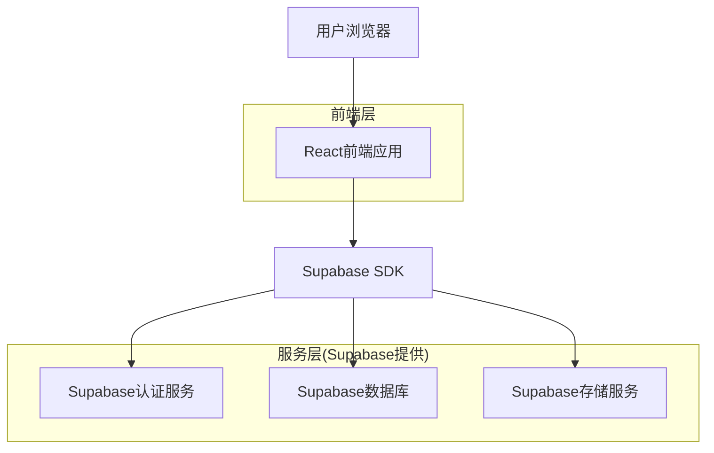
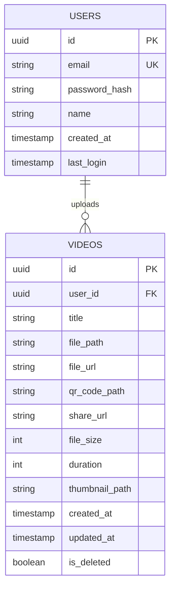

## 1. 架构设计



## 2. 技术描述
- 前端：React@18 + TailwindCSS@3 + Vite
- 初始化工具：vite-init
- 后端：Supabase (提供认证、数据库、存储服务)
- 二维码生成：qrcode.react库
- 视频处理：浏览器原生API + Supabase存储

## 3. 路由定义
| 路由 | 用途 |
|-------|---------|
| / | 首页，视频上传和二维码生成 |
| /login | 登录页面，用户身份验证 |
| /register | 注册页面，新用户注册 |
| /dashboard | 视频管理页面，个人视频库管理 |
| /video/:id | 视频播放页面，通过ID访问具体视频 |
| /share/:id | 分享页面，简化版播放页面供访客使用 |

## 4. API定义

### 4.1 视频上传API
```
POST /api/videos/upload
```

请求参数：
| 参数名 | 参数类型 | 是否必需 | 描述 |
|-----------|-------------|-------------|-------------|
| video | File | 是 | 视频文件，支持MP4/MOV格式 |
| title | string | 否 | 视频标题，默认为文件名 |

响应参数：
| 参数名 | 参数类型 | 描述 |
|-----------|-------------|-------------|
| id | string | 视频唯一标识符 |
| url | string | 视频访问URL |
| qrCode | string | 二维码图片URL |
| status | boolean | 上传状态 |

### 4.2 视频管理API
```
GET /api/videos/list
```

响应参数：
| 参数名 | 参数类型 | 描述 |
|-----------|-------------|-------------|
| videos | array | 视频列表，包含id、title、thumbnail、createdAt |

```
DELETE /api/videos/:id
```

## 5. 数据模型

### 5.1 数据模型定义


### 5.2 数据定义语言
用户表 (users)
```sql
-- 创建用户表
CREATE TABLE users (
    id UUID PRIMARY KEY DEFAULT gen_random_uuid(),
    email VARCHAR(255) UNIQUE NOT NULL,
    password_hash VARCHAR(255) NOT NULL,
    name VARCHAR(100) NOT NULL,
    created_at TIMESTAMP WITH TIME ZONE DEFAULT NOW(),
    last_login TIMESTAMP WITH TIME ZONE DEFAULT NOW()
);

-- 创建索引
CREATE INDEX idx_users_email ON users(email);
```

视频表 (videos)
```sql
-- 创建视频表
CREATE TABLE videos (
    id UUID PRIMARY KEY DEFAULT gen_random_uuid(),
    user_id UUID NOT NULL REFERENCES users(id),
    title VARCHAR(255) NOT NULL,
    file_path VARCHAR(500) NOT NULL,
    file_url VARCHAR(500) NOT NULL,
    qr_code_path VARCHAR(500) NOT NULL,
    share_url VARCHAR(500) NOT NULL UNIQUE,
    file_size INTEGER NOT NULL,
    duration INTEGER,
    thumbnail_path VARCHAR(500),
    created_at TIMESTAMP WITH TIME ZONE DEFAULT NOW(),
    updated_at TIMESTAMP WITH TIME ZONE DEFAULT NOW(),
    is_deleted BOOLEAN DEFAULT FALSE
);

-- 创建索引
CREATE INDEX idx_videos_user_id ON videos(user_id);
CREATE INDEX idx_videos_created_at ON videos(created_at DESC);
CREATE INDEX idx_videos_share_url ON videos(share_url);

-- 设置权限
GRANT SELECT ON videos TO anon;
GRANT ALL PRIVILEGES ON videos TO authenticated;
```

### 5.3 Supabase存储桶设置
```sql
-- 创建存储桶
INSERT INTO storage.buckets (id, name, public) VALUES ('videos', 'videos', true);
INSERT INTO storage.buckets (id, name, public) VALUES 'qr-codes', 'qr-codes', true);

-- 设置存储策略
CREATE POLICY "Public access for videos" ON storage.objects
    FOR SELECT USING (bucket_id = 'videos');

CREATE POLICY "Authenticated users can upload videos" ON storage.objects
    FOR INSERT WITH CHECK (bucket_id = 'videos' AND auth.role() = 'authenticated');

CREATE POLICY "Users can manage their own videos" ON storage.objects
    FOR DELETE USING (bucket_id = 'videos' AND auth.uid() = (storage.foldername(name))[1]::uuid);
```

## 6. 安全考虑
- 视频文件大小限制：最大500MB
- 支持格式：MP4、MOV
- 二维码有效期：永久有效（除非用户删除视频）
- 访问控制：视频分享链接为公开访问，但上传和管理需要身份验证
- 存储安全：使用Supabase内置的安全策略和访问控制